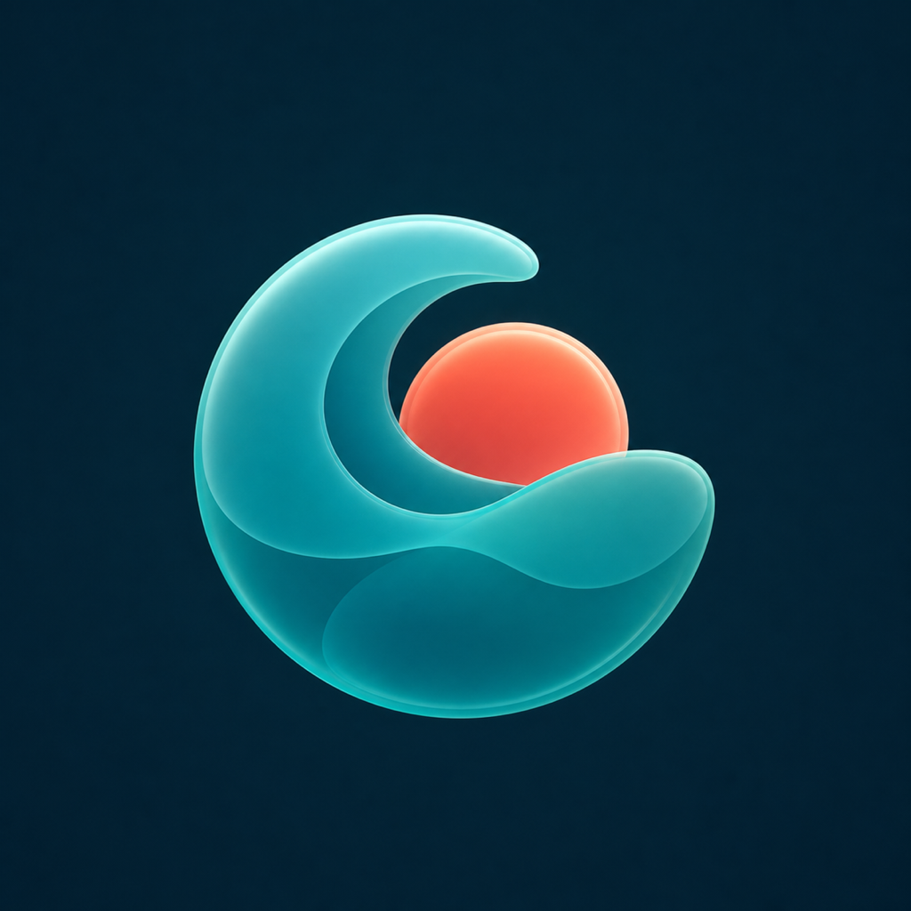
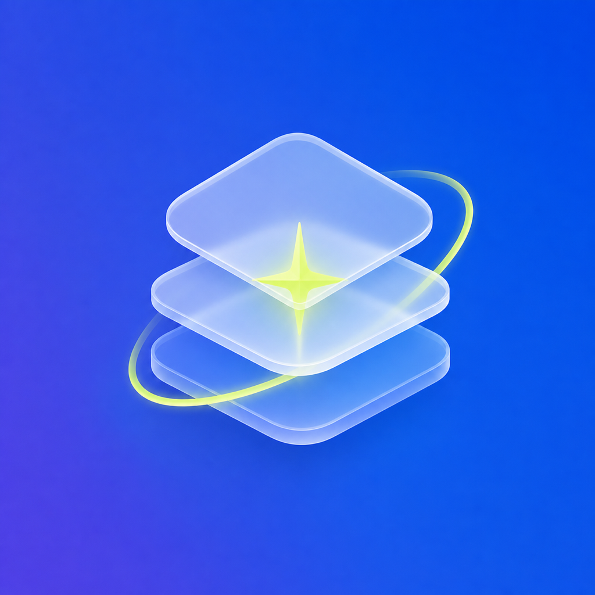
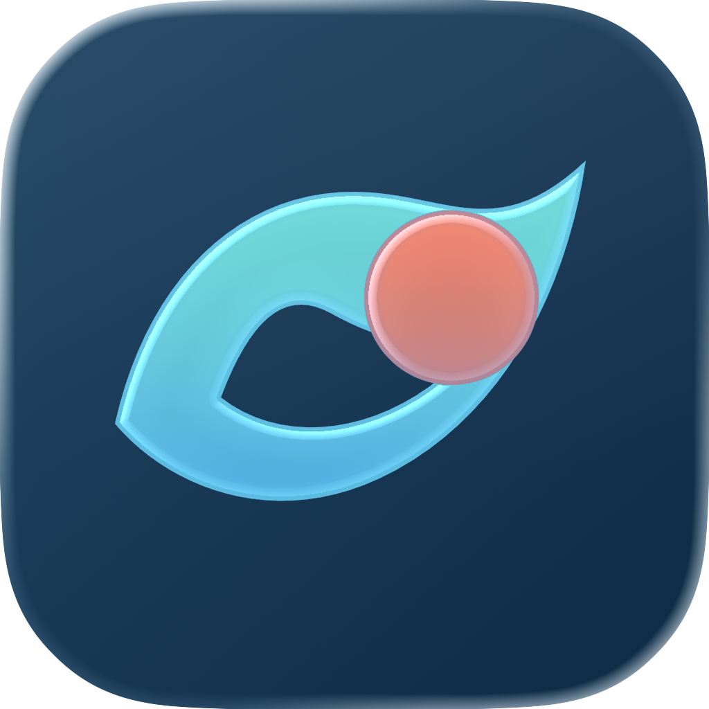
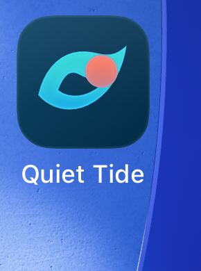

# App Icon Studio

[](https://github.com/metaforismo/app-icon-design-skill/actions/workflows/validate.yml)
[](https://github.com/metaforismo/app-icon-design-skill/actions/workflows/source-freshness.yml)


Design distinctive app icons, explore original directions with image generation, reconstruct clean production layers, and validate the result across Apple platforms.

This repository contains the installable [`design-app-icons`](skills/design-app-icons/SKILL.md) Codex skill, current Apple platform guidance, a deterministic bitmap preflight tool, and four original image-generated case studies.

> Current-source snapshot: **24 July 2026**. Apple’s icon tooling is active and versioned; the skill tells agents to re-check official documentation before release work.

## What makes this different

- **Concept before surface:** start from the app promise and one ownable silhouette.
- **Imagegen with boundaries:** use generated bitmaps for fast, original concept exploration—not as fake vector or `.icon` files.
- **Two production routes:** reconstruct exact SVG geometry, or generate one raster role per image and prove its alpha, alignment, and composite.
- **Current Liquid Glass workflow:** prepare SVG/PNG layers, use at most four Icon Composer groups, and validate current refraction/specular behavior.
- **Platform-aware delivery:** distinguish Icon Composer from tvOS/visionOS asset catalogs and exact legacy-art requirements.
- **Evidence, not vibes:** separate static preflight, Icon Composer, Xcode build, Simulator, device, store, and experiment evidence.
- **Honest ASO testing:** design meaningful Product Page Optimization hypotheses without promising ranking or conversion lift.

## Original example directions

The examples were generated with the built-in image-generation tool from original fictional briefs. User-supplied icons informed only broad visual families and are not redistributed.

| Quiet Tide | Parcel Pulse |
| --- | --- |
| [](examples/quiet-tide/case-study.md) | [](examples/parcel-pulse/case-study.md) |
| Layered abstract identity: one wave, one sun, one silhouette. | Tactile utility metaphor: one parcel, one scan action. |

| Mood Lantern | Orbit Stack |
| --- | --- |
| [](examples/mood-lantern/case-study.md) | [](examples/orbit-stack/case-study.md) |
| Expressive mascot: calm emotion and one luminous core. | Liquid Glass system: three layers and one bright anchor. |

Each case study includes the full prompt, rationale, reconstruction plan, limitations, and provenance. Unless a case explicitly says otherwise, it is a **concept master**, not an Icon Composer file or device-validated shipping icon.

## Production evidence

Quiet Tide goes beyond the concept master. It includes deliberate SVG reconstruction, a real Icon Composer document created in Icon Composer 1.6, an XcodeGen fixture, a successful Xcode 26.6 build, and iOS 26.5 Simulator evidence.

| Icon Composer export | iOS Simulator Home Screen |
| --- | --- |
| [](examples/quiet-tide/redesign-comparison.md) | [](examples/quiet-tide/production/evidence.md) |

The `.icon` package is an actual tool-authored document—not a renamed folder or teaching approximation. Physical-device, App Review, and conversion outcomes remain explicitly untested.

Mood Lantern demonstrates the alternative [layer-first Imagegen workflow](examples/mood-lantern/layer-first/README.md): one backdrop, shell, and glow per generation; actual alpha inspection; key-color cleanup; and a reproducible composite.

[](examples/mood-lantern/layer-first/README.md)

## Install

Clone a tagged release and run the local installer:

```bash
git clone --depth 1 --branch v1.0.0 https://github.com/metaforismo/app-icon-design-skill.git
cd app-icon-design-skill
./scripts/install.sh
```

Or copy the installable skill folder from an existing checkout:

```bash
cp -R skills/design-app-icons "${CODEX_HOME:-$HOME/.codex}/skills/"
```

Then invoke it explicitly:

```text
Use $design-app-icons to create three original icon directions for a private journaling app.
```

Example requests:

- “Audit this existing iOS icon at small sizes and explain what actually needs redesign.”
- “Use these screenshots only as style references and generate an original icon.”
- “Plan SVG layers for Icon Composer and test Default, Dark, Clear, and Tinted appearances.”
- “Migrate this Xcode project from `AppIcon.appiconset` to an `.icon` file without losing the old artwork.”
- “Create three Product Page Optimization icon hypotheses and define what evidence would select a winner.”

## Repository map

```text
.
├── skills/design-app-icons/
│   ├── SKILL.md
│   ├── agents/openai.yaml
│   ├── assets/
│   ├── references/
│   └── scripts/
├── examples/
├── experiments/
├── assets/
├── docs/
├── scripts/
└── tests/
```

The skill itself stays progressively disclosed: the core workflow is in `SKILL.md`; detailed Apple specifications, Liquid Glass behavior, prompt recipes, visual taxonomy, QA, App Store experiments, delivery, and source boundaries live in focused references.

## Static preflight

Install the development dependencies:

```bash
python3 -m venv .venv
. .venv/bin/activate
python3 -m pip install -r requirements-dev.txt
```

Audit an opaque iOS concept and create small-size previews:

```bash
python3 skills/design-app-icons/scripts/icon_qa.py \
  examples/quiet-tide/concept-master.png \
  --platform ios \
  --role concept \
  --preview-dir work/quiet-tide-previews \
  --report work/quiet-tide-audit.json
```

The script checks platform dimensions, format, alpha, corner/edge behavior, and embedded color profile; it also generates aspect-preserving small-size and appearance stress-test previews. Masks and appearance transforms are intentionally heuristic. The CLI cannot validate Icon Composer material, the `.icon` document, Xcode target selection, Simulator, hardware, App Store review, or conversion.

For one-element-per-image raster workflows, use:

```bash
python3 skills/design-app-icons/scripts/prepare_raster_layer.py \
  raw-element.png candidate-element.png \
  --key-color 0,255,0 --fit-box 240,64,784,946

python3 skills/design-app-icons/scripts/compose_raster_layers.py \
  backdrop.png glow.png shell.png --output assembled-proof.png
```

Always inspect the resulting edges. Chroma cleanup is a controlled fallback, not a guarantee that translucent glass or bloom separated cleanly.

## Validate the repository

```bash
python3 scripts/validate_repo.py
python3 -m unittest discover -s tests -v
python3 /path/to/skill-creator/scripts/quick_validate.py skills/design-app-icons
python3 scripts/package_skill.py
```

CI runs the repository validator and tests. The last command is the canonical Codex skill validator and requires a local Codex installation.

## Source and legal boundaries

- Apple’s HIG, developer documentation, videos, and App Store Connect Help are the authority for current platform claims.
- Secondary articles are inspiration and hypotheses, not authoritative Xcode specifications.
- Apple Design Resources are linked rather than bundled.
- The 61 user-supplied icon references are not committed.
- Do not reproduce another developer’s icon, name, character, product, or Apple hardware.
- Following the workflow does not guarantee App Review approval or conversion improvement.

See [Research notes](docs/research-notes.md), [machine-readable source manifest](docs/source-manifest.yaml), [Example methodology](examples/README.md), and the skill’s [source ledger](skills/design-app-icons/references/sources.md).

## License

Code, documentation, and original example assets are available under the [MIT License](LICENSE), to the extent the repository owner can grant those rights. Third-party trademarks remain their owners’ property.
